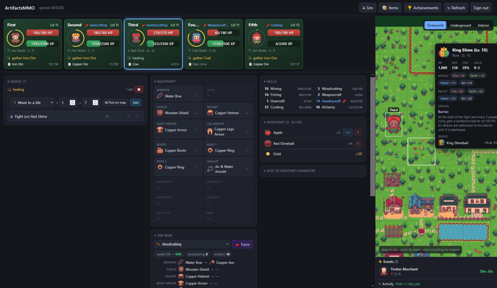
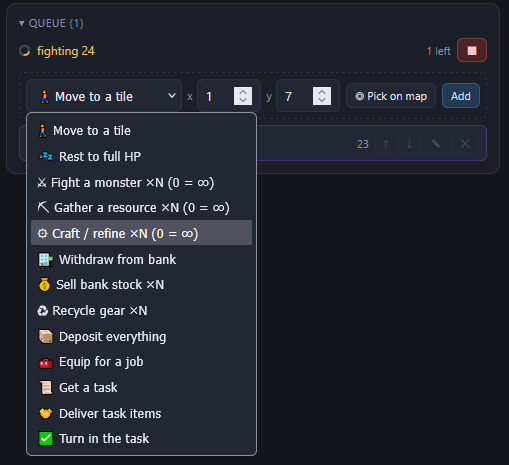
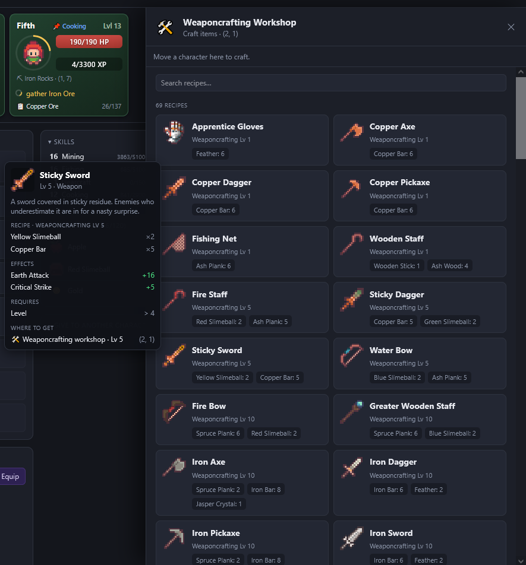

# ArtifactsMMO Client

A small web client for [ArtifactsMMO](https://play.artifactsmmo.com/) that talks
directly to the public game API from the browser. It syncs your account's durable
state **once** at load and then keeps it current from action responses — no
polling — so it stays well inside the API rate limits.

Built with **Vite + TypeScript + Preact** (signals for reactive state). Deploys as
static files to GitHub Pages; no backend.



## Run

```bash
npm install
npm run dev        # dev server with HMR
npm run build      # static production build → dist/
npm run preview    # serve the production build
npm run typecheck  # tsc --noEmit
```

Open the dev URL and paste your API token (from
[artifactsmmo.com](https://artifactsmmo.com/account)). It's stored only in your
browser's `localStorage`. For convenience during development you can instead put
`TOKEN=<your jwt>` in a `.env` file (see `.env.example`) — Vite exposes it to the
app and the token prompt is skipped. `.env` is gitignored.

## Features

- **Canvas world map** — pan/zoom across the overworld/underground/interior layers,
  with your characters drawn as markers and a hover inspector for tiles.
- **Live map events** — time-limited monsters, resources and traveling merchants
  overlay the map with countdowns; they join the fight/gather pickers while active.
- **Character workspace** — roster cards (HP/XP, cooldown throbber, location, task)
  above a dashboard of the selected character: equipment, job-gear preview, combat
  stats, skills, and inventory.
- **The action queue** — the automation engine: a per-character, editable list of
  simple actions (move, fight ×N, gather ×N, craft ×N, bank moves, gear swaps, task
  steps…). A count of 0 means *forever* — infinite crafting cycles
  withdraw-a-bagful → craft → deposit until the bank runs dry. Paced by action
  cooldowns, **survives a page reload**, and skips steps whose map target vanished
  (an event that ended) instead of stalling.
- **Bank-centric gear** — the bank is the single source of truth for equipment: a
  gear step dresses the character in the best set available in the bank at that
  moment (fight sets come from a combat-sim solver; fights re-check the bank every
  round and upgrade mid-grind).
- **Workshop / NPC / bank / tasks panels** — click a tile to craft, trade, manage
  the bank, or handle tasks; hovering any item anywhere shows one unified detail
  popup (stats, recipe, where to get it, prices).
- **Fight-sim playground** (`#/sim`) — plan equipment setups against any monster
  with the deterministic combat simulator.

<p align="center">
  
  &nbsp;&nbsp;
  
</p>

> Automation runs **in the open browser tab** — the page sends the commands, so a
> tab must stay open somewhere for characters to keep working. Run automation in
> **one tab per account** (multiple tabs would double-send and conflict). Mobile
> browsers suspend background tabs, so they aren't reliable for long runs.

## How it works

- **One sync, then no polling.** At boot the app paints instantly from
  `localStorage`, loads the static catalogs from `public/data/*.json` into memory,
  then does a single authoritative read of `/my/characters`, `/my/bank`,
  `/my/bank/items`, and account info. After that, every action response carries the
  full authoritative character (and bank item moves echo the bank), so local state
  is updated from responses alone — see `src/state/apply.ts`. Re-sync only happens
  when you click **Refresh**.
- **Rate-limit aware.** The per-account read endpoints are the scarcest budget
  (~300/hr), so we minimize them. `src/api/client.ts` handles cooldown (error 499)
  and rate-limit (429) retries and pagination.

See [CLAUDE.md](CLAUDE.md) for the architecture in more depth.

## Project structure

```
public/data/*.json   bundled snapshot of the game's static catalogs
public/assets/        map tiles + item/character icons (committed, served locally)
src/
  api/        client (fetch + retry + pagination), typed action calls
  catalog/    load *.json into typed Maps; lookups (item, monster, mapAt, …)
  state/      signals store, persistence, the apply chokepoint, boot sync,
              the queue runner + shared execution mechanics
  ui/         Preact components (MapView, CharacterPanel, CatalogPanel, …)
  types/      api.ts (dynamic) + catalog.ts (static) domain models
```

## Deploy (GitHub Pages)

Pushing to `main` triggers `.github/workflows/deploy.yml`, which builds and
publishes to GitHub Pages. The build's `base` is set from the repo name
(`BASE_PATH=/<repo>/`) so it resolves under `https://<user>.github.io/<repo>/`.
Enable it once under **Settings → Pages → Source: GitHub Actions**. The deployed
build ships no token — each visitor pastes their own into the in-browser gate.

## Refreshing the catalog snapshot

`public/data/*.json` is a snapshot of the game's static data (see
`data/manifest.json` for the server version and fetch time). It only needs
refreshing when the season/version changes. Each file mirrors a public,
unauthenticated endpoint (`/items`, `/maps`, `/monsters`, …) paged at `size=100`.
Icons and map tiles under `public/assets/` are (re)downloaded with `npm run assets`.
